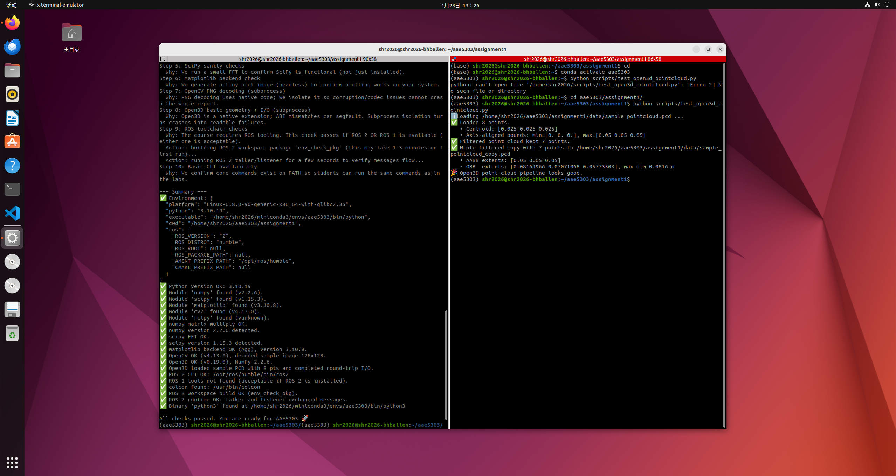
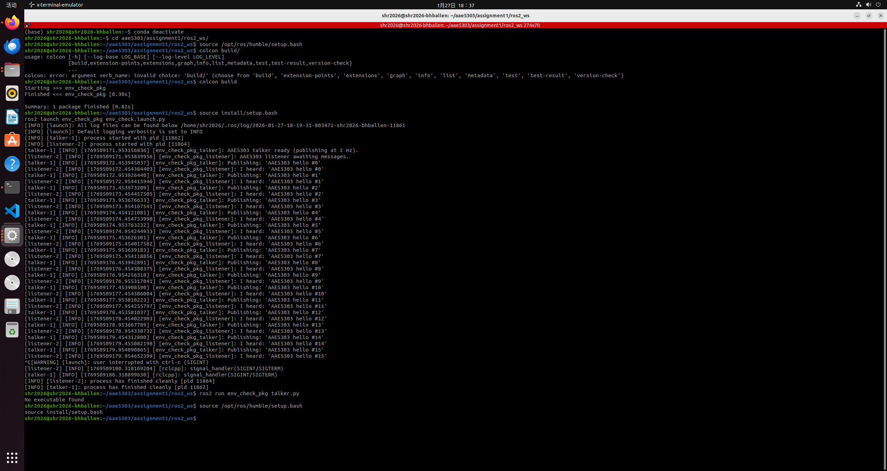

# AAE5303 Environment Setup Report — Template for Students

> **Important:** Follow this structure exactly in your submission README.  
> Your goal is to demonstrate **evidence, process, problem-solving, and reflection** — not only screenshots.

---

## 1. System Information

**Laptop model:**  
_Lenovo Legion 2023_

**CPU / RAM:**  
_AMD Ryzen 9 7945HX with Radeon Graphics, 16GB RAM_

**Host OS:**  
_Windows 11_

**Linux/ROS environment type:**  
_[Choose one:]_
- [ ] Dual-boot Ubuntu
- [ ] WSL2 Ubuntu
- [√] Ubuntu in VM (UTM/VirtualBox/VMware/Parallels)
- [ ] Docker container
- [ ] Lab PC
- [ ] Remote Linux server

---

## 2. Python Environment Check

### 2.1 Steps Taken

Describe briefly how you created/activated your Python environment:

**Tool used:**  
conda virtual environment

**Key commands you ran:**
```bash
conda create -n aae5303 python=3.10
conda activate aae5303
pip install -r requirements.txt
```

**Any deviations from the default instructions:**  
I used a Conda virtual environment instead of the default Python venv. All required packages were installed according to requirements.txt, and everything worked as expected with no functional differences.

### 2.2 Test Results

Run these commands and paste the actual terminal output (not just screenshots):

```bash
python scripts/test_python_env.py
```

**Output:**
```
(aae5303) shr2026@shr2026-bhballen:~/aae5303/assignment1$ python scripts/test_python_env.py
========================================
AAE5303 Environment Check (Python + ROS)
Goal: help you verify your environment and understand what each check means.
========================================

Step 1: Environment snapshot
  Why: We capture platform/Python/ROS variables to diagnose common setup mistakes (especially mixed ROS env).
Step 2: Python version
  Why: The course assumes Python 3.10+; older versions often break package wheels.
Step 3: Python imports (required/optional)
  Why: Imports verify packages are installed and compatible with your Python version.
Step 4: NumPy sanity checks
  Why: We run a small linear algebra operation so success means more than just `import numpy`.
Step 5: SciPy sanity checks
  Why: We run a small FFT to confirm SciPy is functional (not just installed).
Step 6: Matplotlib backend check
  Why: We generate a tiny plot image (headless) to confirm plotting works on your system.
Step 7: OpenCV PNG decoding (subprocess)
  Why: PNG decoding uses native code; we isolate it so corruption/codec issues cannot crash the whole report.
Step 8: Open3D basic geometry + I/O (subprocess)
  Why: Open3D is a native extension; ABI mismatches can segfault. Subprocess isolation turns crashes into readable failures.
Step 9: ROS toolchain checks
  Why: The course requires ROS tooling. This check passes if ROS 2 OR ROS 1 is available (either one is acceptable).
  Action: building ROS 2 workspace package `env_check_pkg` (this may take 1-3 minutes on first run)...
  Action: running ROS 2 talker/listener for a few seconds to verify messages flow...
Step 10: Basic CLI availability
  Why: We confirm core commands exist on PATH so students can run the same commands as in the labs.

=== Summary ===
✅ Environment: {
  "platform": "Linux-6.8.0-90-generic-x86_64-with-glibc2.35",
  "python": "3.10.19",
  "executable": "/home/shr2026/miniconda3/envs/aae5303/bin/python",
  "cwd": "/home/shr2026/aae5303/assignment1",
  "ros": {
    "ROS_VERSION": "2",
    "ROS_DISTRO": "humble",
    "ROS_ROOT": null,
    "ROS_PACKAGE_PATH": null,
    "AMENT_PREFIX_PATH": "/opt/ros/humble",
    "CMAKE_PREFIX_PATH": null
  }
}
✅ Python version OK: 3.10.19
✅ Module 'numpy' found (v2.2.6).
✅ Module 'scipy' found (v1.15.3).
✅ Module 'matplotlib' found (v3.10.8).
✅ Module 'cv2' found (v4.13.0).
✅ Module 'rclpy' found (vunknown).
✅ numpy matrix multiply OK.
✅ numpy version 2.2.6 detected.
✅ scipy FFT OK.
✅ scipy version 1.15.3 detected.
✅ matplotlib backend OK (Agg), version 3.10.8.
✅ OpenCV OK (v4.13.0), decoded sample image 128x128.
✅ Open3D OK (v0.19.0), NumPy 2.2.6.
✅ Open3D loaded sample PCD with 8 pts and completed round-trip I/O.
✅ ROS 2 CLI OK: /opt/ros/humble/bin/ros2
✅ ROS 1 tools not found (acceptable if ROS 2 is installed).
✅ colcon found: /usr/bin/colcon
✅ ROS 2 workspace build OK (env_check_pkg).
✅ ROS 2 runtime OK: talker and listener exchanged messages.
✅ Binary 'python3' found at /home/shr2026/miniconda3/envs/aae5303/bin/python3

All checks passed. You are ready for AAE5303 🚀

```

```bash
python scripts/test_open3d_pointcloud.py
```

**Output:**
```
(aae5303) shr2026@shr2026-bhballen:~/aae5303/assignment1$ python scripts/test_open3d_pointcloud.py
ℹ️ Loading /home/shr2026/aae5303/assignment1/data/sample_pointcloud.pcd ...
✅ Loaded 8 points.
   • Centroid: [0.025 0.025 0.025]
   • Axis-aligned bounds: min=[0. 0. 0.], max=[0.05 0.05 0.05]
✅ Filtered point cloud kept 7 points.
✅ Wrote filtered copy with 7 points to /home/shr2026/aae5303/assignment1/data/sample_pointcloud_copy.pcd
   • AABB extents: [0.05 0.05 0.05]
   • OBB  extents: [0.08164966 0.07071068 0.05773503], max dim 0.0816 m
🎉 Open3D point cloud pipeline looks good.

```

**Screenshot:**  
_[Include one screenshot showing both tests passing]_



---

## 3. ROS 2 Workspace Check

### 3.1 Build the workspace

Paste the build output summary (final lines only):

```bash
source /opt/ros/humble/setup.bash
colcon build
```

**Expected output:**
```
Summary: 1 package finished [x.xx s]
```

**Your actual output:**
```
Summary: 1 package finished [0.82s]
```

### 3.2 Run talker and listener

Show both source commands:

```bash
source /opt/ros/humble/setup.bash
source install/setup.bash
```

**Then run talker:**
```bash
ros2 run env_check_pkg talker.py
```

**Output (3–4 lines):**
```
shr2026@shr2026-bhballen:~/aae5303/assignment1/ros2_ws$ ros2 run env_check_pkg talker 
[INFO] [1769510043.342391464] [env_check_pkg_talker]: AAE5303 talker ready (publishing at 2 Hz).
[INFO] [1769510043.843132587] [env_check_pkg_talker]: Publishing: 'AAE5303 hello #0'
[INFO] [1769510044.342713262] [env_check_pkg_talker]: Publishing: 'AAE5303 hello #1'
[INFO] [1769510044.842934220] [env_check_pkg_talker]: Publishing: 'AAE5303 hello #2'
[INFO] [1769510045.343766213] [env_check_pkg_talker]: Publishing: 'AAE5303 hello #3'
[INFO] [1769510045.842881742] [env_check_pkg_talker]: Publishing: 'AAE5303 hello #4'
[INFO] [1769510046.342896316] [env_check_pkg_talker]: Publishing: 'AAE5303 hello #5'

```

**Run listener:**
```bash
ros2 run env_check_pkg listener.py
```

**Output (3–4 lines):**
```
shr2026@shr2026-bhballen:~/aae5303/assignment1/ros2_ws$ ros2 run env_check_pkg listener 
[INFO] [1769510045.200222742] [env_check_pkg_listener]: AAE5303 listener awaiting messages.
[INFO] [1769510045.344421449] [env_check_pkg_listener]: I heard: 'AAE5303 hello #3'
[INFO] [1769510045.843545421] [env_check_pkg_listener]: I heard: 'AAE5303 hello #4'
[INFO] [1769510046.343594736] [env_check_pkg_listener]: I heard: 'AAE5303 hello #5'

```

**Alternative (using launch file):**
```bash
ros2 launch env_check_pkg env_check.launch.py
```

**Screenshot:**  
_[Include one screenshot showing talker + listener running]_



---

## 4. Problems Encountered and How I Solved Them

> **Note:** Write 2–3 issues, even if small. This section is crucial — it demonstrates understanding and problem-solving.

### Issue 1: Python script path error

**Cause / diagnosis:**  
The error occurred because the Python script was executed from the home directory instead of the assignment root directory, which caused the relative file path to be incorrect.

**Fix:**  
I changed the working directory to the assignment folder before running the script, which resolved the issue.

```bash
cd ~/aae5303/assignment1
```

**Reference:**  
AI assistant (ChatGPT)

---

### Issue 2: ROS 2 executable not found

**Cause / diagnosis:**  
This issue was caused by attempting to run a ROS 2 node using a .py extension, while the package provides installed ROS 2 executables whose names are defined during the build and install process, rather than directly using the Python source file names.

**Fix:**  
I checked the list of available executables in the package and ran the node using the correct executable name.

```bash
ros2 pkg executables env_check_pkg
ros2 run env_check_pkg talker
ros2 run env_check_pkg listener
```

**Reference:**  
ROS 2 documentation and AI assistant

---

### Issue 3 (Optional): No network connectivity in the virtual machine

**Cause / diagnosis:**  
The virtual machine initially had no network access because the network adapter was configured to use NAT mode, which did not provide proper connectivity in this setup.

**Fix:**  
I changed the virtual machine network adapter setting from NAT mode to bridged mode, after which network connectivity was restored.

```bash
# No command or code, it's just a software problem #
```

**Reference:**  
A tutorial video on Bilibili explaining virtual machine network configuration.

---

## 5. Use of Generative AI (Required)

Choose one of the issues above and document how you used AI to solve it.

> **Goal:** Show critical use of AI, not blind copying.

### 5.1 Exact prompt you asked

**Your prompt:**
```
为什么运行ros2 launch env_check_pkg env_check.launch.py 可以，
运行ros2 run env_check_pkg talker.py 
ros2 run env_check_pkg listener.py就会报错说No executable found
```

### 5.2 Key helpful part of the AI's answer

**AI's response (relevant part only):**
```
ros2 launch 能跑，但 ros2 run env_check_pkg talker.py 报错，是因为：

launch 启动的是“包里定义的可执行目标”，
而 ros2 run 要求你提供“真实注册的可执行文件名”，
而这个包里根本没有叫 talker.py 的可执行。
```

### 5.3 What you changed or ignored and why

Explain briefly:
- Did the AI recommend something unsafe?
- Did you modify its solution?
- Did you double-check with official docs?

**Your explanation:**  
I initially assumed that the executable name should match the source file name:  talker.py, but this format was incorrect. Based on the AI's explanation, I verified the registered executables using ros2 pkg executables and confirmed that the correct executable name was talker. So I didn't follow the incorrect command and adjusted my command to match the actual installed executable instead. Additionally, I also cross-checked this behavior with the official ROS 2 documentation regarding executable targets.

### 5.4 Final solution you applied

Show the exact command or file edit that fixed the problem:

```bash
ros2 pkg executables env_check_pkg
ros2 run env_check_pkg talker
ros2 run env_check_pkg listener 
```

**Why this worked:**  
Because ros2 run requires the exact name of a built and installed executable target, and the package registers the node as talker rather than talker.py. This behavior is clearly documented on the official ROS website, which states that the command format is ros2 run <package_name> <executable_name>.

---

## 6. Reflection (3–5 sentences)

Short but thoughtful:

- What did you learn about configuring robotics environments?
- What surprised you?
- What would you do differently next time (backup, partitioning, reading error logs, asking better AI questions)?
- How confident do you feel about debugging ROS/Python issues now?

**Your reflection:**

This assignment helped me better understand the relationship between Python environments and the ROS 2 toolchain. I learned the importance of carefully reading error messages and distinguishing between source files and installed executables in ROS 2. The process also improved my debugging skills, especially when resolving environment and configuration issues step by step. Overall, I feel more confident setting up and troubleshooting development environments for future robotics projects. I also learned the importance of verifying AI suggestions against official documentation instead of applying them blindly. In addition, I realized that AI assistance is not always the most direct or accurate way to resolve certain issues, and that similar problems may have already been encountered and solved by others through platforms such as video tutorials and community discussions. In some cases, these resources like explanatory videos and even their comment sections can provide more intuitive and precise solutions.

---

## 7. Declaration

✅ **I confirm that I performed this setup myself and all screenshots/logs reflect my own environment.**

**Name:**  
Sun Haoran 

**Student ID:**  
25109354G

**Date:**  
2026.1.28

---

## Submission Checklist

Before submitting, ensure you have:

- [√] Filled in all system information
- [√] Included actual terminal outputs (not just screenshots)
- [√] Provided at least 2 screenshots (Python tests + ROS talker/listener)
- [√] Documented 2–3 real problems with solutions
- [√] Completed the AI usage section with exact prompts
- [√] Written a thoughtful reflection (3–5 sentences)
- [√] Signed the declaration

---

**End of Report**
